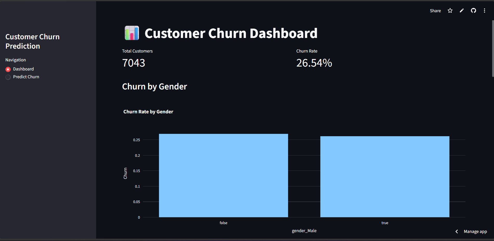
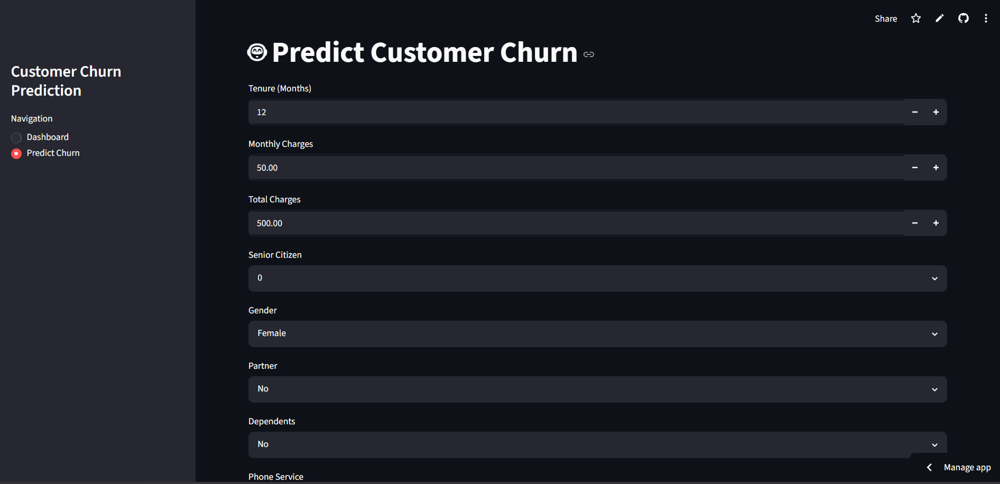

# 📊 Customer Churn Prediction

A Machine Learning web application that predicts customer churn using a Random Forest Classifier and an interactive Streamlit dashboard.

## 🚀 Features

- Customer churn prediction
- Interactive dashboard
- Churn rate analysis
- Feature importance visualization
- Real-time predictions

## 🛠️ Technologies Used

- Python
- Pandas
- Scikit-Learn
- Streamlit
- Plotly
- Joblib


  
```

## ⚙️ Installation

```bash
pip install -r requirements.txt
streamlit run app.py
```

## 🤖 Machine Learning Model

- Random Forest Classifier
- StandardScaler
- Feature Engineering & One-Hot Encoding

## 📊 Dashboard Features

- Total Customers
- Churn Rate
- Churn by Gender
- Contract Analysis
- Internet Service Analysis
- Monthly Charges Distribution
- Feature Importance
## 📸 Application Screenshots

### Dashboard



### Prediction Page


## 👨‍💻 Author

**Vristi Sharma**

Aspiring Data Scientist & Machine Learning Enthusiast
